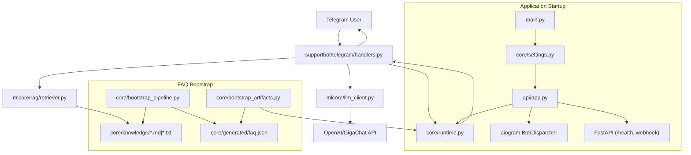
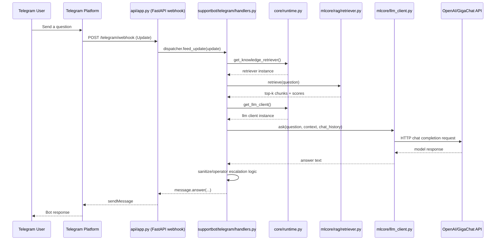

# Module Interaction Schemas

## High-Level Module Interaction

```mermaid
flowchart TD
    U["Telegram User"] --> TG["supportbot/telegram/handlers.py"]
    TG --> RT["core/runtime.py"]

    subgraph App["Application Startup"]
      M["main.py"] --> S["core/settings.py"]
      S --> A["api/app.py"]
      A --> RT
      A --> BOT["aiogram Bot/Dispatcher"]
      A --> API["FastAPI (/health, webhook)"]
    end

    TG --> RAG["mlcore/rag/retriever.py"]
    TG --> LLM["mlcore/llm_client.py"]
    RAG --> K["core/knowledge/*.md|*.txt"]
    LLM --> EXT["OpenAI/GigaChat API"]

    subgraph Bootstrap["FAQ Bootstrap"]
      BP["core/bootstrap_pipeline.py"] --> K
      BP --> G["core/generated/faq.json"]
      BA["core/bootstrap_artifacts.py"] --> G
      BA --> RT
    end

    RT --> TG
    TG --> U
```

## Request Sequence (Webhook Path)

```mermaid
sequenceDiagram
    participant User as Telegram User
    participant Telegram as Telegram Platform
    participant API as api/app.py (FastAPI webhook)
    participant H as supportbot/telegram/handlers.py
    participant RT as core/runtime.py
    participant RAG as mlcore/rag/retriever.py
    participant LLM as mlcore/llm_client.py
    participant Ext as OpenAI/GigaChat API

    User->>Telegram: Send a question
    Telegram->>API: POST /telegram/webhook (Update)
    API->>H: dispatcher.feed_update(update)

    H->>RT: get_knowledge_retriever()
    RT-->>H: retriever instance
    H->>RAG: retrieve(question)
    RAG-->>H: top-k chunks + scores

    H->>RT: get_llm_client()
    RT-->>H: llm client instance
    H->>LLM: ask(question, context, chat_history)
    LLM->>Ext: HTTP chat completion request
    Ext-->>LLM: model response
    LLM-->>H: answer text

    H->>H: sanitize/operator escalation logic
    H-->>API: message.answer(...)
    API-->>Telegram: sendMessage
    Telegram-->>User: Bot response
```
